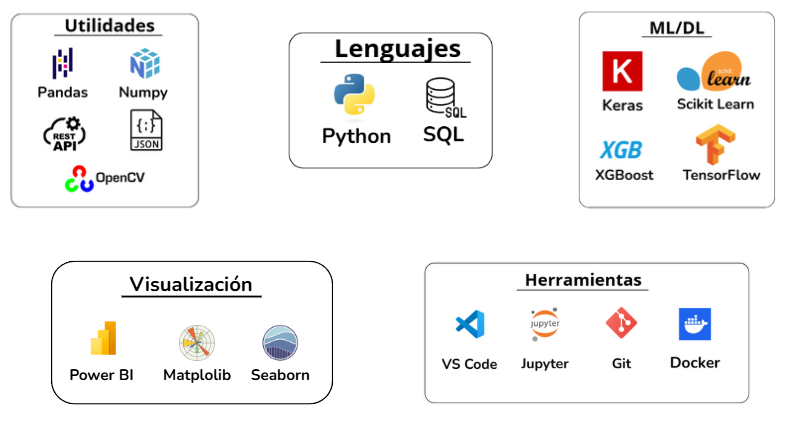

# Portfolio Juan Natoli Rojo

[Habilidades](#Habilidades) | [Proyectos](#Proyectos) | [Educación](#Educación) | [Contacto](#Contacto)

  

  

    <h2>¡Hola! Soy Juan Natoli</h2>
    
<strong>Científico de Datos Junior</strong> con formación especializada en machine learning, procesamiento de datos y visualización. Experiencia profesional en el análisis técnico de sistemas, detección de patrones y gestión de equipos.

    
<strong>Apasionado por aplicar soluciones basadas en datos</strong> para optimizar procesos y facilitar la toma de decisiones.

  

# Habilidades

---

</aside>

<aside>

# Proyectos

---

</aside>

Analicé y limpié más de 8 millones de registros de ventas de una cadena de supermercados, agrupando productos y tiendas con técnicas de *clustering* y prediciendo las ventas del mes siguiente mediante modelos de *machine learning* para optimizar el abastecimiento de stock.

                                                                                                           

[https://github.com/NatoliJuan/TFM-DS-Market](https://github.com/NatoliJuan/TFM-DS-Market)

                                                    

Predije la probabilidad de infección por malware en equipos con Windows mediante técnicas de *machine learning*, evaluando el rendimiento de tres modelos distintos con diversas métricas.

                                                                                                                                                                              

                                      

[https://github.com/NatoliJuan/Malware-infection](https://github.com/NatoliJuan/Malware-infection)

Desarrollé una aplicación interactiva en Python que procesa vídeo en tiempo real desde distintas fuentes, aplicando filtros visuales y detección de rostros mediante *OpenCV*. Permite activar o desactivar efectos desde el teclado durante la visualización del flujo de vídeo.

                                                      

[https://github.com/NatoliJuan/Filter-Cam](https://github.com/NatoliJuan/Filter-Cam)

<aside>

# Educación

---

</aside>

- **CURSO ANÁLISIS DE DATOS PARA BIG DATA EN AWS, UDEMY.  SEPTIEMBRE 2025**
    - Amazon S3, Glue Notebooks, Athena, Lambda, QuickSight y Step Functions.
    
- **INGLÉS PARA DESARROLLADORES (B1), FREECODECAMPS.  AGOSTO 2025**
    - 73 diálogos diferentes diseñados para ampliar vocabulario en un entorno tecnológico profesional.
- **CURSO BIG DATA CON APACHE SPARK, UDEMY.  JULIO 2025**
    - RDDs, Spark SQL, Dataframes y Streaming.
    - Machine Learning con Spark ML
    - Analítica avanzada, visualización de datos, **Spark Koalas** y despliegue de clusters de Spark con Databricks.
- **MASTER EN CIENCIA DE DATOS, ESCUELA NUCLIO DIGITAL.  SEPTIEMBRE 2024 – MAYO 2025**
    - Especialización en análisis de datos y modelos predictivos
    - Tecnologías: Python (numpy, pandas, matplotlib, scikit-learn, xgboost), SQL/NoSQL, Power BI
    - Machine Learning: modelos supervisados, no supervisados y por refuerzo
    - Deep Learning: redes neuronales con TensorFlow, Keras y transformadores
    - Herramientas: Git, Google Colab, Jupyter Notebook, Docker, MLOps, Apache Airflow
- **AUTODIDACTA EN PROGRAMACIÓN PYTHON.  JULIO 2023 – SEPTIEMBRE 2024**
    - IDE Visual Studio Cod
    - Programación orientada a objetos
    - Librerías: random, json, datetime, opencv, API requests
- **ESCUELAS AVE MARÍA 1994 - 1999GRADO SUPERIOR EN ELECTRÓNICA**
    - Conocimientos avanzados en electrónica y electricidad.

<aside>

# Contacto

---

</aside>

📧 **Email:** natolijuan@gmail.com

📱 **Teléfono:** +34 653685949

💼 **LinkedIn:**  [linkedin.com/in/juan-natoli](https://www.linkedin.com/in/juan-natoli/)

🐙 **GitHub:**   [github.com/NatoliJuan](https://github.com/NatoliJuan)

